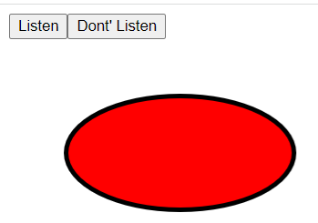

# React Konva
React Konva is a JavaScript library for drawing complex canvas graphics using [React](https://reactjs.org/)

# picture Demo

**How to  Listen or Don’t Listen to Events in React-Konva ?**
[Documentation](https://konvajs.org/docs/events/Listen_for_Events.html)